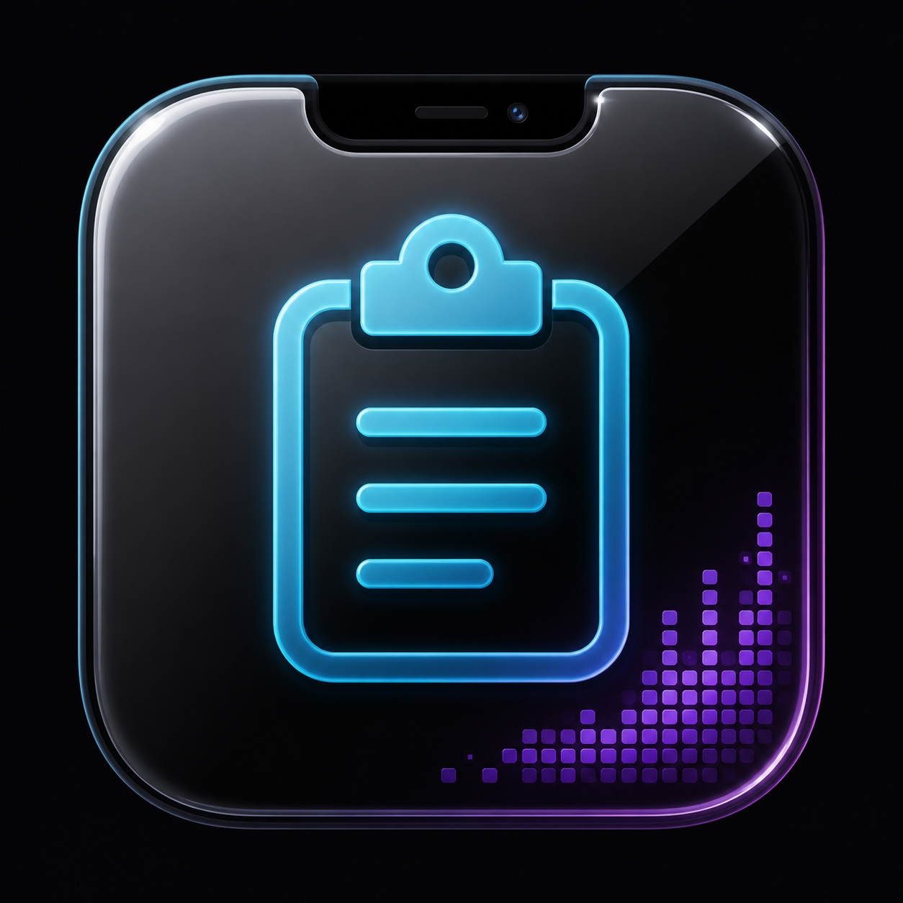

# NotchPaste

<p align="center">
  
</p>

NotchPaste is a macOS notch utility that combines clipboard history with Vibe-style Agent status. It keeps recent text, images, links, and files close to the MacBook notch, while also showing Claude, Codex, and Gemini sessions when coding agents are running or waiting for input.

**Status:** v0.1 MVP under active development.

## Features

- Clipboard history in the notch: text, images, links, and files.
- Search and category filters for recent, favorites, text, images, links, and files.
- Click to copy, optional auto-paste, and draggable file/image entries.
- Vibe Agent tab for Claude, Codex, and Gemini session status.
- Inline permission handling for `Allow`, `Deny`, `Allow Once`, `Allow All`, and `Bypass` style flows where supported.
- AskUserQuestion handling with selectable answers and a reply input.
- Latest code diff preview for agent tool activity.
- Agent activity notch modes, custom animated icons, and flame-wave running effects.
- Menu bar icon fallback for screens or layouts where the notch hides status items.

## Requirements

- macOS 14 Sonoma or later.
- MacBook with a notch is recommended.
- Xcode 15+ and XcodeGen for development builds.

## Install And Run

Clone the repo:

```bash
git clone https://github.com/kai-wu-cortex/notchpaste.git
cd notchpaste
```

Generate the Xcode project:

```bash
brew install xcodegen
xcodegen generate
open NotchPaste.xcodeproj
```

Run the `NotchPaste` scheme in Xcode, or build from Terminal:

```bash
xcodebuild -project NotchPaste.xcodeproj -scheme NotchPaste build
```

The app is a menu-bar/notch app, so it does not open a normal Dock window.

## First-Time Permissions

NotchPaste needs Accessibility permission if you want it to paste back into the previous app automatically.

1. Launch NotchPaste.
2. Open macOS System Settings when prompted.
3. Go to Privacy & Security -> Accessibility.
4. Enable NotchPaste.

Without Accessibility permission, NotchPaste can still copy items back to the system clipboard, but it cannot reliably send `Command-V` into the target app.

## Clipboard Usage

- Open the notch panel from the notch, menu bar icon, or the global shortcut.
- Default shortcut: `Shift-Command-V`.
- Search from the top search field.
- Use the sidebar to switch between recent, favorites, text, images, links, and files.
- Click an entry to copy or paste it, depending on your settings.
- Star an entry to keep it in favorites.
- Drag file or image entries out of the list to attach them in other apps.

## Vibe / Agent Usage

Open the Vibe tab from the top-right tab button in the notch panel.

When supported agents run, NotchPaste shows:

- Active sessions for Claude, Codex, and Gemini.
- Running, waiting, stopped, and completed states.
- Permission requests with inline approval controls.
- AskUserQuestion prompts with answer options.
- Jump buttons to return to the related terminal session.
- Recent event history, including user input, agent output, and compact code diff previews.

The app installs local hook helpers on launch where supported. Restart Claude, Codex, or Gemini after first launching NotchPaste if a running session does not appear immediately.

## Settings

Open Settings from the gear button in the notch panel.

Common options:

- Enable or pause clipboard monitoring.
- Toggle auto-paste after selecting an item.
- Close or keep the panel open after copying.
- Show or hide the menu bar icon.
- Change the global shortcut.
- Tune Agent notch mode, size, icon, position, and animation.
- Upload custom icon files for agent activity states.

Advanced debug tools are hidden by default. Click the version row five times quickly to open debug panels for flame-wave parameters and notch layer inspection.

## Development

Run tests:

```bash
xcodebuild -project NotchPaste.xcodeproj -scheme NotchPaste test
```

Useful build command for CI-style checks:

```bash
xcodebuild build -scheme NotchPaste -destination 'platform=macOS'
```

## Notes

- Clipboard history is stored locally in SQLite under Application Support.
- Vibe/Agent integration is local-first and uses local hooks/socket communication.
- Some terminal jump behavior depends on the terminal app exposing enough AppleScript or accessibility surface.

## License

MIT. See [LICENSE](LICENSE).
